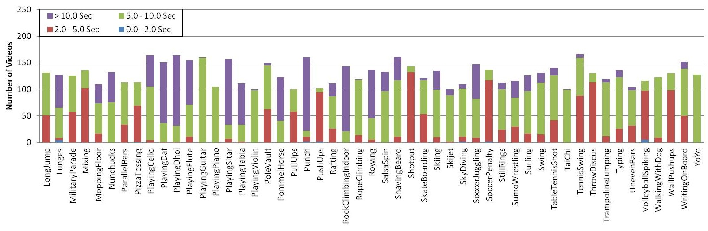

# Action Recogntion

## Implementation Goal

The aim is to implement ResNets[1], specifically the 18 layer deep and 50 layer deep networks to benchmark on the UCF-101 dataset.

## Dataset Description

UCF101 is a collection of real-world action videos from YouTube with 101 different action categories. 
The largest variety of actions is provided by UCF101, which has 13320 videos across 101 action categories. It is also the most difficult data set to date due to the wide range of camera motion, object appearance and pose, object scale, viewpoint, cluttered background, illumination conditions, and other factors. UCF101 intends to promote additional study into action recognition by learning and exploring new realistic action categories because the majority of the existing action recognition data sets are not realistic and are staged by actors.\
The videos are divided into 25 groups, each of which may contain 4–7 videos of an activity, from the 101 action categories. Videos from the same group could have comparable backgrounds, points of view, and other characteristics in common.
The action categories can be divided into five types: 1)Human-Object Interaction 2) Body-Motion Only 3) Human-Human Interaction 4) Playing Musical Instruments 5) Sports.[2]

Here is an example of 3 random frames from the first video of the class label ApplyEyeMakeup.

  
   
  

Some statsitics on the video count.

   
  

Some statistics on the video durations.

   
  

All these statistics have been borrowed from the dataset description.[2]

## Model Description
To implement the ResNet the Slow backbone of SlowFast was used. PySlowFast is a video understanding codebase from FAIR for reproducing state-of-the-art video models.[3] The model is decribed in the table below.

   

A copy of PyTorchVideo an be found in the folder as it has been corrected locally for (https://github.com/facebookresearch/pytorchvideo/issues/213).

## Results

Best accuracy is achieved as 50.67406819984139% with Res18 and 

## References
[1] Deep Residual Learning for Image Recognition; Kaiming He, Xiangyu Zhang, Shaoqing Ren, Jian Sun at CVPR 2016 DOI: 10.1109/CVPR.2016.90\
[2] UCF101: A Dataset of 101 Human Actions Classes From Videos in The Wild; Khurram Soomro, Amir Roshan Zamir, Mubarak Shah at arXiv Preprints arXiv:1212.0402\
[3] SlowFast Networks for Video Recognition; Christoph Feichtenhofer, Haoqi Fan, Jitendra Malik, Kaiming He at ICCV 2019 DOI: 10.1109/ICCV.2019.00630
